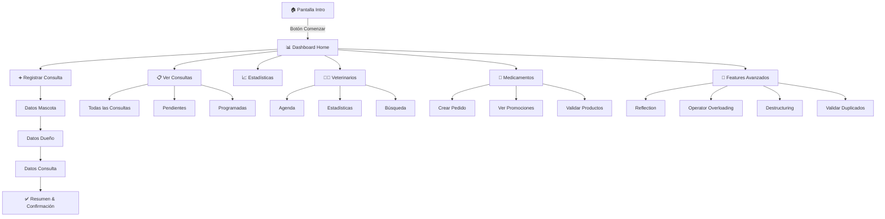
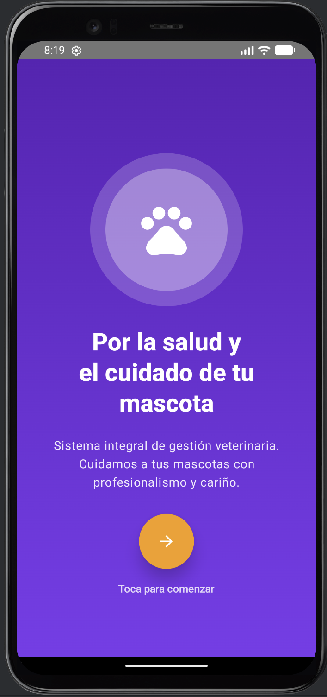
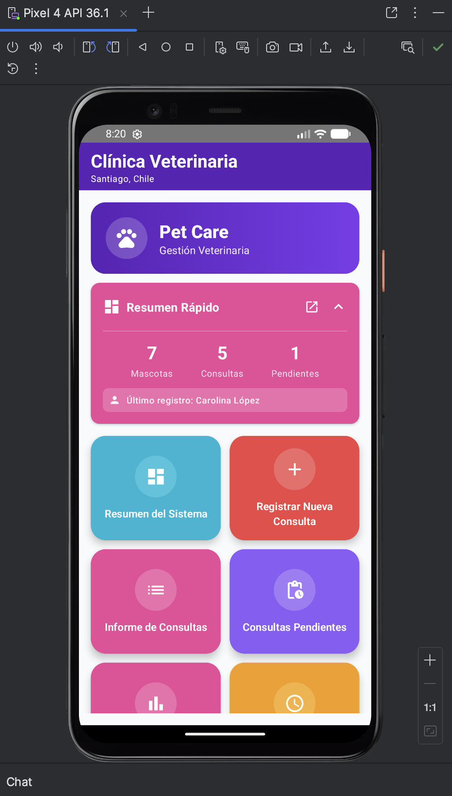
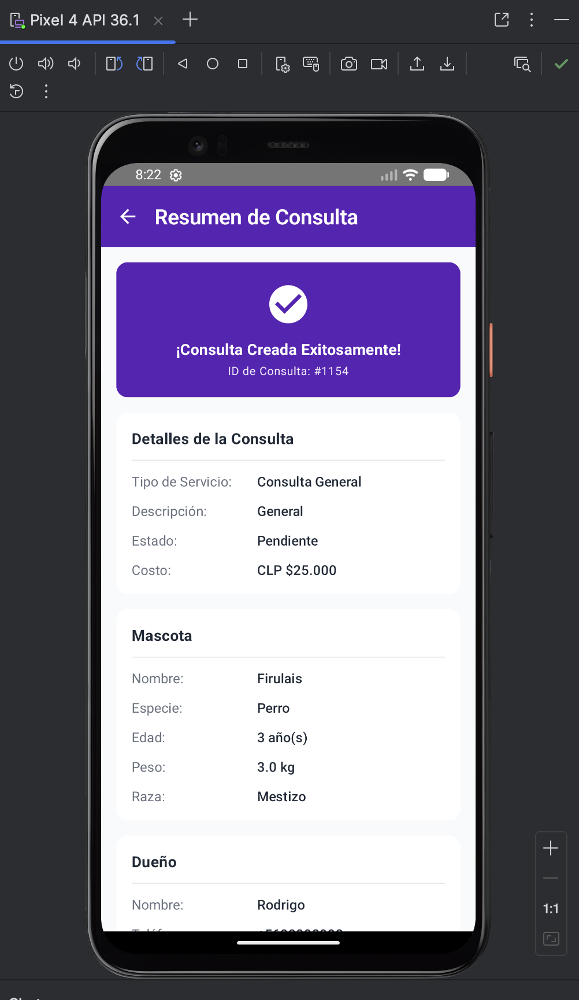

<div align="center">

# 🐾 Vet Clinic Android

### Sistema Integral de Gestión Veterinaria

[](https://www.android.com)
[](https://kotlinlang.org)
[](https://developer.android.com/jetpack/compose)
[](https://m3.material.io)
[](./LICENSE)

**Aplicación Android nativa empresarial** que implementa un sistema completo de gestión veterinaria con arquitectura moderna, patrones avanzados de Kotlin y una experiencia de usuario excepcional mediante Jetpack Compose Material 3.

[📱 Demo](#-capturas-de-pantalla) • [🚀 Características](#-características-principales) • [📖 Documentación](#-arquitectura--organización) • [⚙️ Instalación](#️-instalación-y-configuración)

---

</div>

## 🎯 Visión General

**Vet Clinic Android** es una solución integral que digitaliza y optimiza la gestión completa de clínicas veterinarias. Construida con las tecnologías más modernas del ecosistema Android, demuestra implementación profesional de:

- ✅ **Arquitectura MVVM** limpia y escalable
- ✅ **Jetpack Compose** 100% declarativa con Material Design 3
- ✅ **Kotlin avanzado**: Coroutines, Flow, Reflection, Operator Overloading
- ✅ **Navegación multi-pantalla** con Navigation Compose
- ✅ **Validaciones robustas** con Regex y manejo de errores centralizado
- ✅ **Compatibilidad extendida** desde Android 7.0 (API 24) mediante desugaring
- ✅ **Código documentado** siguiendo estándares de la industria

---

## 🚀 Características Principales

### 📋 Gestión Integral de Consultas

<table>
<tr>
<td width="50%">

#### Registro Multi-Step
- **Formulario guiado** en 3 pasos (Mascota → Dueño → Consulta)
- **Validaciones en tiempo real** con feedback inmediato
- **Cálculo automático** de costos según tipo de servicio
- **Descuentos inteligentes** por múltiples mascotas (15%)
- **Generación de ID único** para cada consulta
- **Resumen completo** con banner de confirmación

</td>
<td width="50%">

#### Seguimiento y Reportes
- **Dashboard interactivo** con métricas en tiempo real
- **Filtros dinámicos** (Pendientes/Programadas/Completadas)
- **Chips de estado** con código de colores
- **Listado completo** de consultas con scroll infinito
- **Informes detallados** por consulta
- **Estadísticas agregadas** del sistema

</td>
</tr>
</table>

### 👨‍⚕️ Gestión de Veterinarios

- **Agenda digital** con disponibilidad horaria
- **Perfiles especializados** con licencias y experiencia
- **Búsqueda avanzada** por nombre y especialidad
- **Estadísticas individuales** de rendimiento
- **Asignación automática** a consultas según disponibilidad

### 💊 Control de Medicamentos y Pedidos

- **Catálogo completo** con precios y stock en tiempo real
- **Sistema de promociones** mediante anotaciones custom (`@Promocionable`)
- **Creación de pedidos** con validaciones numéricas
- **Combinación de pedidos** usando operator overloading (`+`)
- **Comparación de medicamentos** con equals personalizado (`==`)
- **Detección de duplicados** automática
- **Validación de productos** con Ranges de Kotlin

### 🔬 Características Avanzadas de Kotlin

<details>
<summary><b>Ver implementaciones técnicas avanzadas</b></summary>

#### Operator Overloading
```kotlin
// Combinar pedidos
val pedidoCombinado = pedido1 + pedido2

// Comparar medicamentos
if (medicamento1 == medicamento2) { /* ... */ }
```

#### Reflection
- Inspección de metadatos en runtime
- Análisis de propiedades y anotaciones
- Pantalla dedicada para visualización

#### Destructuring Declarations
```kotlin
val (nombre, telefono, email) = dueno
val (id, descripcion, costo) = consulta
```

#### Custom Annotations
```kotlin
@Promocionable
data class Medicamento(...)
```

#### Extension Functions & DSL
```kotlin
fun Double.formatearMoneda(): String
fun String.validarEmail(): Boolean
```

</details>

---

## 🏗️ Arquitectura & Stack Tecnológico

### Arquitectura MVVM + Repository Pattern

```
┌─────────────────────────────────────────────────────────────────┐
│                         UI Layer (Compose)                       │
│  ┌─────────────┐  ┌──────────────┐  ┌──────────────────────┐   │
│  │  Screens    │  │  Components  │  │  Navigation Graph    │   │
│  └──────┬──────┘  └──────┬───────┘  └──────────┬───────────┘   │
│         │                │                      │                │
│         └────────────────┴──────────────────────┘                │
│                           │                                      │
│                    ┌──────▼───────┐                             │
│                    │   ViewModel   │                             │
│                    │   (StateFlow) │                             │
│                    └──────┬────────┘                             │
├───────────────────────────┼──────────────────────────────────────┤
│                    ┌──────▼────────┐                             │
│                    │   Services    │   (Repository Layer)        │
│                    │  (Business    │                             │
│                    │   Logic)      │                             │
│                    └──────┬────────┘                             │
├───────────────────────────┼──────────────────────────────────────┤
│                    ┌──────▼────────┐                             │
│                    │   Models      │   (Domain Layer)            │
│                    │  (Data        │                             │
│                    │   Classes)    │                             │
│                    └───────────────┘                             │
└─────────────────────────────────────────────────────────────────┘
```

### Stack Tecnológico Completo

#### 🎨 Frontend & UI
| Tecnología | Versión | Propósito |
|-----------|---------|-----------|
| **Jetpack Compose** | 1.5.4 | Framework UI declarativo |
| **Material Design 3** | Latest | Sistema de diseño |
| **Compose Navigation** | 2.7.5 | Navegación entre pantallas |
| **Compose Icons Extended** | 1.5.4 | Librería de iconos Material |
| **Custom Components** | - | BannerCard, Cards reutilizables |

#### ⚙️ Backend & Lógica
| Tecnología | Versión | Propósito |
|-----------|---------|-----------|
| **Kotlin** | 1.9.20 | Lenguaje principal |
| **Coroutines** | 1.7.3 | Programación asíncrona |
| **StateFlow** | - | Gestión de estados reactivos |
| **Kotlin Reflection** | 1.9.20 | Introspección en runtime |

#### 🛠️ Herramientas & Build
| Tecnología | Versión | Propósito |
|-----------|---------|-----------|
| **Gradle** | 8.13 | Sistema de build |
| **Kotlin DSL** | - | Configuración type-safe |
| **Desugaring** | 2.0.4 | Compatibilidad java.time |
| **Lint Custom** | - | Reglas personalizadas |

#### 📦 Dependencias Clave
```kotlin
// Navigation & ViewModel
implementation("androidx.navigation:navigation-compose:2.7.5")
implementation("androidx.lifecycle:lifecycle-viewmodel-compose:2.6.2")
implementation("androidx.lifecycle:lifecycle-runtime-compose:2.6.2")

// Compose BOM
implementation(platform("androidx.compose:compose-bom:2023.10.01"))

// Kotlin Reflection
implementation(kotlin("reflect"))

// Desugaring (Compatibilidad API 24)
coreLibraryDesugaring("com.android.tools:desugar_jdk_libs:2.0.4")
```

### Estructura de Proyecto

```
vet-clinic-android/
├── app/
│   ├── src/main/
│   │   ├── java/com/example/vet_clinic_android/
│   │   │   ├── model/              # 📦 Data classes y anotaciones
│   │   │   │   ├── Consulta.kt
│   │   │   │   ├── Mascota.kt
│   │   │   │   ├── Dueno.kt
│   │   │   │   ├── Veterinario.kt
│   │   │   │   ├── Medicamento.kt
│   │   │   │   └── Pedido.kt (operator overloading)
│   │   │   │
│   │   │   ├── service/            # 🔧 Lógica de negocio
│   │   │   │   ├── ConsultaService.kt
│   │   │   │   ├── MascotaService.kt
│   │   │   │   ├── DuenoService.kt
│   │   │   │   ├── VeterinarioService.kt
│   │   │   │   ├── MedicamentoService.kt
│   │   │   │   └── PromocionService.kt
│   │   │   │
│   │   │   ├── ui/                 # 🎨 Capa de presentación
│   │   │   │   ├── components/     # Componentes reutilizables
│   │   │   │   │   └── BannerCard.kt
│   │   │   │   │
│   │   │   │   ├── screens/        # Pantallas (18 screens)
│   │   │   │   │   ├── IntroScreen.kt
│   │   │   │   │   ├── HomeScreen.kt
│   │   │   │   │   ├── RegisterConsultaScreen.kt
│   │   │   │   │   ├── ConsultasScreens.kt
│   │   │   │   │   ├── EstadisticasScreen.kt
│   │   │   │   │   ├── VeterinariosScreens.kt
│   │   │   │   │   ├── AdvancedScreens.kt
│   │   │   │   │   └── OtherScreens.kt
│   │   │   │   │
│   │   │   │   ├── navigation/     # Sistema de navegación
│   │   │   │   │   ├── Screen.kt
│   │   │   │   │   └── VetClinicNavigation.kt
│   │   │   │   │
│   │   │   │   ├── viewmodels/     # ViewModels
│   │   │   │   │   └── VetClinicViewModel.kt
│   │   │   │   │
│   │   │   │   └── theme/          # Material Theme
│   │   │   │       ├── Color.kt
│   │   │   │       ├── Theme.kt
│   │   │   │       └── Type.kt
│   │   │   │
│   │   │   └── util/               # ⚡ Utilidades
│   │   │       ├── Validaciones.kt
│   │   │       ├── Formateo.kt
│   │   │       ├── Mensajes.kt
│   │   │       └── ManejadorExcepciones.kt
│   │   │
│   │   ├── res/                    # Recursos Android
│   │   └── AndroidManifest.xml
│   │
│   ├── build.gradle.kts            # Configuración del módulo
│   └── lint.xml                    # Reglas lint personalizadas
│
├── gradle/                         # Gradle Wrapper
├── docs/screenshots/               # 📸 Capturas de pantalla
├── .gitignore                      # Archivos ignorados
├── README.md                       # 📄 Este archivo
├── LICENSE                         # MIT License
└── SOLUCION_API_24.md             # Documentación técnica

```

---

## ⚙️ Instalación y Configuración

### Requisitos del Sistema

```
✓ Android Studio Giraffe (2022.3.1) o superior
✓ JDK 11 (configurado automáticamente por Gradle Wrapper)
✓ Android SDK 24+ (Android 7.0 Nougat o superior)
✓ Gradle 8.13 (incluido en el wrapper)
✓ Mínimo 4GB RAM, 8GB recomendado
```

### Instalación Rápida

```bash
# 1️⃣ Clonar el repositorio
git clone https://github.com/RodrigoSanchezDev/vet-clinic-android.git
cd vet-clinic-android

# 2️⃣ Dar permisos de ejecución al wrapper (Linux/macOS)
chmod +x gradlew

# 3️⃣ Sincronizar y construir
./gradlew clean assembleDebug

# 4️⃣ (Opcional) Ejecutar en emulador
./gradlew installDebug
```

### Instalación en Android Studio

1. **File → Open** → Seleccionar carpeta del proyecto
2. Esperar sincronización de Gradle
3. **Build → Make Project** (Ctrl+F9 / ⌘F9)
4. **Run → Run 'app'** (Shift+F10 / ⌃R)

### Variables de Entorno (Opcional)

```bash
# En ~/.bashrc o ~/.zshrc
export ANDROID_HOME=$HOME/Library/Android/sdk
export PATH=$PATH:$ANDROID_HOME/emulator
export PATH=$PATH:$ANDROID_HOME/tools
export PATH=$PATH:$ANDROID_HOME/platform-tools
```

---

## 📱 Guía de Uso

### Flujo Completo de la Aplicación



### Casos de Uso Principales

#### 1. Registrar una Nueva Consulta

```
📱 Dashboard → "Registrar Nueva Consulta"

Paso 1: Datos de la Mascota
  ├─ Nombre (validación con ñ y tildes)
  ├─ Especie (dropdown)
  ├─ Raza
  ├─ Edad (numérico, rango validado)
  └─ Peso (decimal, rango validado)

Paso 2: Datos del Dueño
  ├─ Nombre completo
  ├─ Teléfono (validación regex)
  ├─ Email (validación regex)
  ├─ RUT (opcional)
  └─ Dirección

Paso 3: Datos de la Consulta
  ├─ Tipo de servicio (dropdown)
  ├─ Descripción/Motivo
  ├─ Tiempo estimado (minutos)
  └─ Número de mascotas (descuento automático si > 1)

Resultado: Banner verde con ID de consulta generado
```

#### 2. Ver Estadísticas del Sistema

```
📱 Dashboard → "Estadísticas Sistema"

Visualización en tiempo real:
  ├─ Total de consultas
  ├─ Desglose por estado (Pendiente/Programada/Completada)
  ├─ Ingresos totales
  ├─ Promedio por consulta
  └─ Servicios más solicitados (Top 5)
```

#### 3. Gestionar Pedidos de Medicamentos

```
📱 Dashboard → "Crear Pedido Medicamentos"

Crear Pedido:
  ├─ Nombre del cliente
  ├─ Seleccionar medicamento
  ├─ Cantidad (validación numérica)
  └─ Confirmación con banner de éxito

Combinar Pedidos (Operator +):
  📱 Dashboard → "Combinar Pedidos"
  └─ Visualización de pedido1 + pedido2 = pedidoCombinado
```

---

## 🎨 Capturas de Pantalla

<div align="center">

### 🚀 Pantalla de Bienvenida


*Pantalla de introducción con branding y CTA directo al dashboard*

---

### 🏠 Dashboard Principal


*Menu principal con cuadrícula de 18 funcionalidades*

---

### ✅ Registro Exitoso


*Banner de confirmación con ID de consulta y detalles completos*

</div>

---

## 🔒 Seguridad y Validaciones

### Sistema de Validación Centralizado

```kotlin
// Validaciones con Regex
✓ Email: formato válido (nombre@dominio.com)
✓ Teléfono: formatos chilenos (+56912345678)
✓ Nombres: soporte para ñ, tildes y caracteres especiales
✓ RUT: validación de dígito verificador

// Validaciones con Ranges
✓ Edad mascota: 0..30 años
✓ Peso mascota: 0.1..200.0 kg
✓ Tiempo consulta: 10..120 minutos
✓ Número mascotas: 1..5

// Validaciones de negocio
✓ Costos: siempre positivos, formato moneda chilena
✓ IDs únicos: generación automática sin colisiones
✓ Estados: enum cerrado (Pendiente/Programada/Completada)
```

### Manejo de Errores

```kotlin
try {
    // Operación de negocio
} catch (e: IllegalArgumentException) {
    // Error de validación - feedback al usuario
} catch (e: Exception) {
    // Error inesperado - log + mensaje genérico
}
```

---

## 🧪 Testing y Calidad de Código

### Estrategia de Testing

```
├── Unit Tests
│   ├── Servicios de negocio
│   ├── Validaciones
│   └── Modelos con operator overloading
│
├── Integration Tests
│   └── ViewModels con StateFlow
│
└── UI Tests (Compose)
    ├── Navegación entre pantallas
    ├── Formularios multi-step
    └── Interacciones de usuario
```

### Métricas de Calidad

```bash
# Ejecutar lint
./gradlew lint

# Generar reporte de lint
./gradlew lintDebug

# Ver reporte
open app/build/reports/lint-results-debug.html
```

### Build Automático

```bash
# Build de debug
./gradlew assembleDebug

# Build de release (con ProGuard)
./gradlew assembleRelease

# Instalar en dispositivo conectado
./gradlew installDebug
```

---

## 📚 Documentación Técnica Adicional

### Documentos Incluidos

| Documento | Descripción |
|-----------|-------------|
| [`SOLUCION_API_24.md`](./SOLUCION_API_24.md) | Detalles sobre soporte API 24 con desugaring |
| [`LICENSE`](./LICENSE) | Licencia MIT del proyecto |
| `build_output.log` | Logs del último build exitoso |

### Configuración de Lint Personalizada

El archivo `app/lint.xml` configura reglas específicas:

```xml
<!-- Ignorar NewApi para java.time (desugaring activo) -->
<issue id="NewApi" severity="informational">
    <ignore regexp="java\.time\..*" />
</issue>
```

### Gradle Configuration Highlights

```kotlin
android {
    compileSdk = 34
    defaultConfig {
        minSdk = 24  // Android 7.0 con desugaring
        targetSdk = 34
    }
    
    compileOptions {
        isCoreLibraryDesugaringEnabled = true  // ⭐ Clave
    }
}
```

---

## 🗺️ Roadmap y Mejoras Futuras

### 🚧 Versión 2.0 (Planificado)

- [ ] **Persistencia Local**
  - Room Database para historiales
  - DataStore para preferencias
  - Exportación a PDF de consultas

- [ ] **Integración Cloud**
  - Firebase Authentication
  - Firestore para sincronización
  - Storage para imágenes de mascotas

- [ ] **Features Adicionales**
  - Calendario con recordatorios
  - Notificaciones push
  - Firma digital de veterinarios
  - Historial médico completo

- [ ] **Mejoras UI/UX**
  - Dark theme completo
  - Animaciones avanzadas
  - Soporte tablets/foldables
  - Accesibilidad mejorada

- [ ] **Testing**
  - Cobertura >80%
  - Tests E2E automatizados
  - CI/CD con GitHub Actions

---

## 🤝 Contribuciones

Las contribuciones son bienvenidas y apreciadas. Para contribuir:

### Proceso de Contribución

1. **Fork** el repositorio
2. Crear una rama descriptiva:
   ```bash
   git checkout -b feature/nueva-funcionalidad
   ```
3. Hacer commits semánticos:
   ```bash
   git commit -m "feat: agregar búsqueda de mascotas"
   ```
4. Push a la rama:
   ```bash
   git push origin feature/nueva-funcionalidad
   ```
5. Abrir un **Pull Request** con descripción detallada

### Guías de Estilo

```kotlin
// ✅ Buenas prácticas
- Nombres descriptivos en español para dominio
- Documentación KDoc en funciones públicas
- Composables con preview
- Manejo de errores explícito
- StateFlow para estados reactivos

// ❌ Evitar
- Lógica de negocio en Composables
- Strings hardcodeados (usar strings.xml)
- Composables sin parámetros por defecto
- Uso de !! (null assertion)
```

### Tipos de Commits (Conventional Commits)

```
feat:     Nueva funcionalidad
fix:      Corrección de bug
docs:     Cambios en documentación
style:    Formato de código
refactor: Refactorización
test:     Tests
chore:    Tareas de mantenimiento
```

---

## 👨‍💻 Autor

<div align="center">

### Rodrigo Sánchez

[](mailto:rodrigo@sanchezdev.com)
[](https://sanchezdev.com)
[](https://linkedin.com)
[](https://github.com/RodrigoSanchezDev)

**Desarrollador Android Senior** especializado en Kotlin y Jetpack Compose

</div>

---

## 📄 Licencia

Este proyecto está licenciado bajo la **MIT License** - ver el archivo [LICENSE](./LICENSE) para más detalles.

```
MIT License

Copyright (c) 2025 Rodrigo Sánchez

Permission is hereby granted, free of charge, to any person obtaining a copy
of this software and associated documentation files (the "Software"), to deal
in the Software without restriction, including without limitation the rights
to use, copy, modify, merge, publish, distribute, sublicense, and/or sell
copies of the Software, and to permit persons to whom the Software is
furnished to do so, subject to the following conditions:

The above copyright notice and this permission notice shall be included in all
copies or substantial portions of the Software.
```

---

## 🙏 Agradecimientos

- **Material Design Team** por el sistema de diseño
- **JetBrains** por Kotlin y herramientas excepcionales  
- **Google Android Team** por Jetpack Compose
- **Comunidad Open Source** por librerías y soporte

---

<div align="center">

### ⭐ Si este proyecto te fue útil, considera darle una estrella

**Desarrollado con ❤️ usando Kotlin y Jetpack Compose**

[🔝 Volver arriba](#-vet-clinic-android)

</div>

